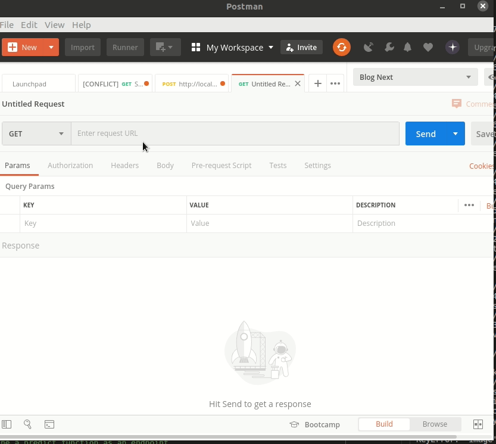

# Fashion MNIST Keras Rest api back end

### Running
- Install dependencies in server.py
- python server.py
- curl -X post -F image=@images/boot.png 'http://localhost:5000/predict'

## Using Postman
